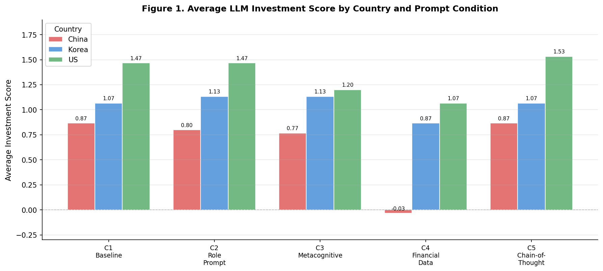
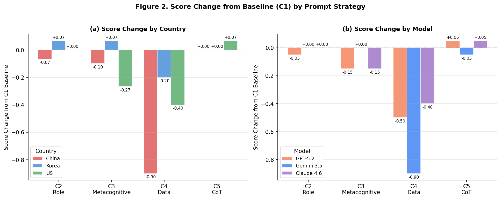
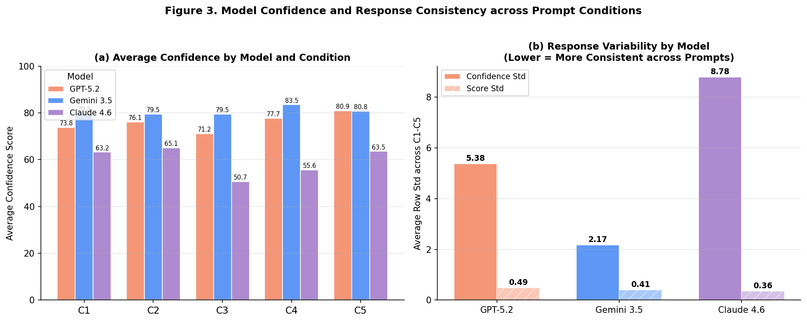
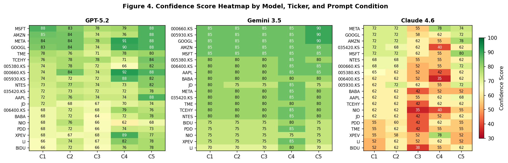
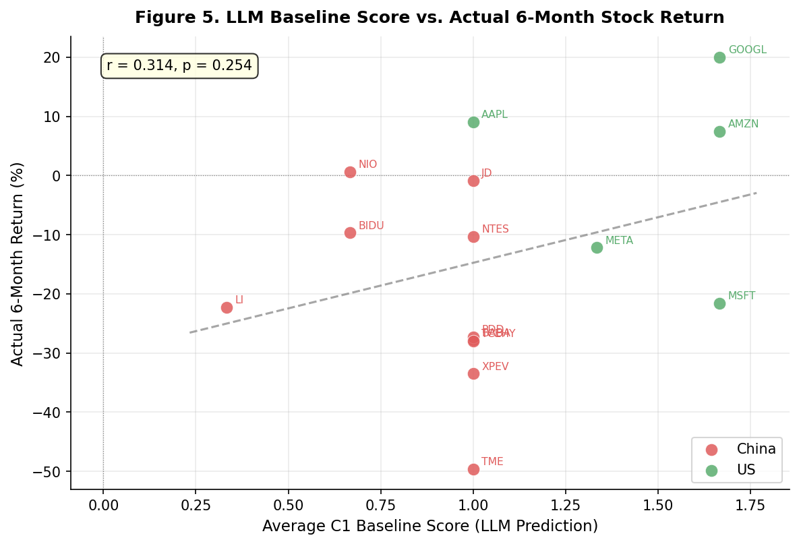
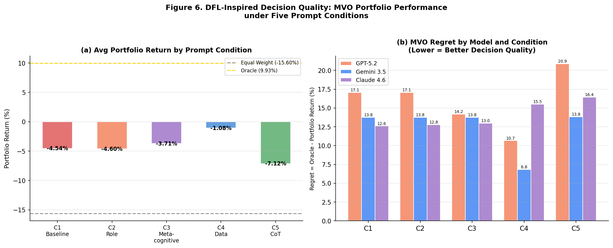

# Prompt Strategy Evaluation for LLM Investment Recommendations

**IE412 AI for Finance — Term Project**  
UNIST, Spring 2026

---

## What is this project about?

Large language models (LLMs) like GPT, Gemini, and Claude are increasingly being used for financial analysis and investment advice. However, prior research has shown that LLMs can exhibit systematic biases in their investment recommendations — for example, favoring certain markets or being overconfident about particular stocks.

This project asks a simple but important question:

> **Does the way you write a prompt actually change the investment recommendation an LLM gives you? And if so, which prompting strategy leads to the best investment decisions?**

To answer this, we designed five different prompting strategies and systematically tested them across three LLM models and 20 stocks from China, Korea, and the US. We then evaluated not just whether the scores changed, but whether those changes actually led to better portfolio performance — inspired by the Decision-Focused Learning (DFL) framework covered in this course.

---

## The Five Prompt Strategies

We tested five progressively different ways of asking the same investment question:

| Condition | Name | What it does |
|-----------|------|--------------|
| **C1** | Baseline | Just asks for a recommendation with no additional context. This is our control condition. |
| **C2** | Role Prompting | Assigns the LLM the role of an "objective financial analyst." Tests whether giving the model a persona changes its answers. |
| **C3** | Metacognitive | Explicitly tells the model that it may have cognitive biases (e.g., familiarity bias, overconfidence) and asks it to account for these. |
| **C4** | Financial Data Injection | Provides actual financial data (P/E ratio, revenue growth, 6-month return) and asks the model to rely only on this data. |
| **C5** | Chain-of-Thought (CoT) | Asks the model to reason step-by-step through business fundamentals, financial health, macro environment, and risks before giving a recommendation. |

---

## Dataset

- **20 stocks** across three markets:
  - 🇨🇳 10 Chinese stocks: NIO, TME, BABA, JD, PDD, XPEV, TCEHY, LI, BIDU, NTES
  - 🇰🇷 5 Korean stocks: Samsung (005930.KS), SK Hynix (000660.KS), Hyundai (005380.KS), NAVER (035420.KS), Samsung SDI (006400.KS)
  - 🇺🇸 5 US stocks: AAPL, MSFT, GOOGL, META, AMZN
- **3 LLM models**: GPT-5.2 Instant, Gemini 3.5 Flash, Claude Sonnet 4.6
- **5 prompt conditions**: C1 through C5
- **Total experiments**: 20 stocks × 3 models × 5 conditions = **300 LLM responses**
- **Market data**: 6-month daily returns and covariance matrix fetched from yfinance (2025-12-19 to 2026-06-22)

Each LLM response included:
- **Score**: integer from -2 (Strong Sell) to +2 (Strong Buy)
- **Confidence**: integer from 0 to 100

---

## Figures

### Figure 1 — Average Investment Score by Country and Prompt Condition


**What it shows:** The average investment score given by all three LLMs to stocks from each country (China, Korea, US), broken down by prompt condition (C1–C5).

**Why it matters:** This gives us a broad picture of how scores differ across markets and whether specific prompt strategies systematically raise or lower scores for particular regions. The most striking result is C4, where Chinese stocks drop to nearly 0 — suggesting that when the model is forced to look at actual financial data, it becomes much more cautious about Chinese stocks.

---

### Figure 2 — Score Change from Baseline (C1) by Prompt Strategy


**What it shows:** How much each prompt strategy changes the LLM's score compared to the no-guidance baseline (C1). Positive = scores went up, negative = scores went down.

**Why it matters:** This directly answers "does prompt design matter?" C4 causes the largest drop (-0.90 for both China and Gemini), while C2, C3, and C5 produce much smaller changes. Statistically, only C4 produces a significant difference from baseline (p < 0.001).

---

### Figure 3 — Model Confidence and Response Consistency


**What it shows:** (a) The average confidence score each model reports across conditions, and (b) how much each model's confidence and scores vary across the five prompt conditions (measured as standard deviation).

**Why it matters:** The three models behave very differently. Gemini consistently reports high confidence (~80) and barely changes across prompts (Std = 2.17), suggesting it is largely unaffected by prompt framing. Claude reports the lowest confidence (~60) and is the most sensitive to prompt changes (Std = 8.78), especially dropping significantly in C3 when told about its own limitations. This reveals distinct "personalities" in how each model processes context.

---

### Figure 4 — Confidence Score Heatmap


**What it shows:** A detailed heatmap of confidence scores for every combination of model, stock ticker, and prompt condition. Green = high confidence, red = low confidence.

**Why it matters:** This makes the model behavior patterns immediately visible. Gemini's heatmap is almost entirely uniform green — it gives the same confidence to almost everything. Claude's heatmap shows a clear red column under C3 (Metacognitive), meaning that explicitly acknowledging uncertainty causes Claude to become much less confident across all stocks. GPT sits somewhere in between, with some variation but no dramatic drops.

---

### Figure 5 — LLM Baseline Score vs. Actual 6-Month Return


**What it shows:** A scatter plot comparing the average C1 baseline score each stock received from the LLMs against its actual 6-month stock return. A regression line is fitted across all stocks.

**Why it matters:** This tells us whether the LLM recommendations were actually accurate. The Pearson correlation is r = 0.314 with p = 0.254 — not statistically significant. In other words, the LLMs' baseline recommendations were essentially uncorrelated with real-world performance. Notably, many Chinese stocks received Buy recommendations (Score = +1) despite losing 20–50% of their value over the period.

---

### Figure 6 — MVO Portfolio Performance under Five Prompt Conditions


**What it shows:** (a) The actual portfolio return you would have achieved by using each prompt condition's LLM scores as inputs to a Mean-Variance Optimization (MVO) portfolio, compared to an equal-weight benchmark and an oracle (perfect foresight) portfolio. (b) The "regret" — how far each model/condition combination fell short of the oracle portfolio.

**Why it matters:** This is the most practically important result. It applies the Decision-Focused Learning concept from the course: we're not just asking whether the predictions are accurate, but whether they lead to better investment decisions. C4 is the only condition to produce a positive portfolio return (+1.72%) and the lowest average regret (13.93%). Interestingly, C5 (Chain-of-Thought) actually produces the worst portfolio performance (-3.75%), suggesting that step-by-step reasoning may reinforce existing biases rather than correct them.

---

## Key Findings

1. **Financial data injection (C4) is the most effective prompting strategy** — the only condition to produce both statistically significant score changes (p < 0.001) and positive portfolio returns (+1.72%). Simply telling the model "here is the data" outperforms all other strategies.

2. **Role prompting and metacognitive prompting have limited effect** — C2 and C3 do not produce statistically significant changes in scores, suggesting that adjusting the model's "mindset" through prompt framing is less effective than providing concrete information.

3. **Chain-of-Thought (C5) is a double-edged sword** — despite being a popular prompting technique, it produces the worst portfolio performance in this study (-3.75%), possibly because structured reasoning amplifies the model's existing biases rather than correcting them.

4. **Models have distinct behavioral profiles** — Gemini is highly consistent but unresponsive to prompt changes; Claude is the most sensitive and drops confidence significantly under metacognitive prompting; GPT sits in between.

5. **LLM predictions do not correlate with actual returns** (r = 0.314, p = 0.254), but prompt design still meaningfully affects downstream decision quality (regret ranges from 13.9% to 19.4%).

---

## Summary Table

| Condition | Avg Score | Portfolio Return | Regret vs Oracle |
|-----------|-----------|-----------------|-----------------|
| C1 Baseline | 1.067 | -1.14% | 16.79% |
| C2 Role Prompting | 1.050 | -1.29% | 16.93% |
| C3 Metacognitive | 0.967 | -1.15% | 16.79% |
| **C4 Financial Data** | **0.467** | **+1.72%** | **13.93%** |
| C5 Chain-of-Thought | 1.083 | -3.75% | 19.39% |

Oracle (perfect foresight): +15.64% &nbsp;|&nbsp; Equal Weight benchmark: -13.73%

---

## Repository Structure

```
prompt-strategy-llm-investment/
├── README.md              # This file
├── analysis.py            # Full analysis code (data loading, figures, statistics)
├── term_project.csv       # Experimental data — all 300 LLM responses
└── figures/
    ├── fig1_country_condition.png
    ├── fig2_score_change.png
    ├── fig3_model_confidence_behavior.png
    ├── fig4_confidence_heatmap.png
    ├── fig5_accuracy.png
    └── fig6_dfl_decision_quality.png
```

---

## How to Run

```bash
# 1. Install required packages
pip install pandas numpy scipy matplotlib yfinance

# 2. Place term_project.csv in the same directory as analysis.py

# 3. Run the analysis
python analysis.py
```

> **Note:** Market data (6-month returns and covariance matrix) is automatically fetched from yfinance at runtime. Results may differ slightly depending on when you run the code, since the 6-month window shifts over time.

---

## Methodology Notes

- **Scoring**: Each LLM was prompted to rate stocks from -2 (Strong Sell) to +2 (Strong Buy) with a self-reported confidence score from 0 to 100. Each stock-model-condition combination was queried in a fresh conversation window to avoid context contamination.
- **Portfolio construction**: Mean-Variance Optimization (MVO, Markowitz 1952) was used to translate LLM scores into portfolio weights. LLM scores were scaled to expected return estimates based on the actual return standard deviation over the period. The covariance matrix was estimated from 6-month annualized daily returns (×252). Risk-aversion coefficient λ = 2.0, long-only constraint applied.
- **Decision quality**: Regret is defined as (Oracle portfolio return) − (LLM-based portfolio return), following the Decision-Focused Learning framework. The oracle portfolio uses actual realized returns as inputs to MVO.

---

## AI Tools Used

This project used **Claude (Anthropic)** for brainstorming, code generation, debugging, and writing assistance. All generated code was verified by running it locally and checking outputs manually. The experimental data — all 300 LLM responses — were collected manually by the author using each model's web interface, with separate conversation windows for each stock-condition pair.

---

## References

- Lee, H., Seo, J., Park, S., Lee, J., Ahn, W., Choi, C., Lopez-Lira, A., & Lee, Y. (2025). Your AI, Not Your View: The Bias of LLMs in Investment Analysis. *Proceedings of the 6th ACM International Conference on AI in Finance*, 150–158. 
  > Prior work demonstrating systematic LLM investment bias. Motivates this study and informs the design of the C3 Metacognitive prompt condition.

- Lee, J., Jeon, H., Bae, H., & Lee, Y. (2025). Return Prediction for Mean-Variance Portfolio Selection: How Decision-Focused Learning Shapes Forecasting Models. *Proceedings of the 6th ACM International Conference on AI in Finance*, 114–122. 
  > Source of the Decision-Focused Learning framework and MVO Regret concept. Directly applied in Figure 6 to evaluate downstream portfolio decision quality.

- Markowitz, H. M. (1952). Portfolio Selection. *The Journal of Finance*, 7(1), 77–91.
  > Original Mean-Variance Optimization formulation. Directly implemented in the portfolio construction step.
